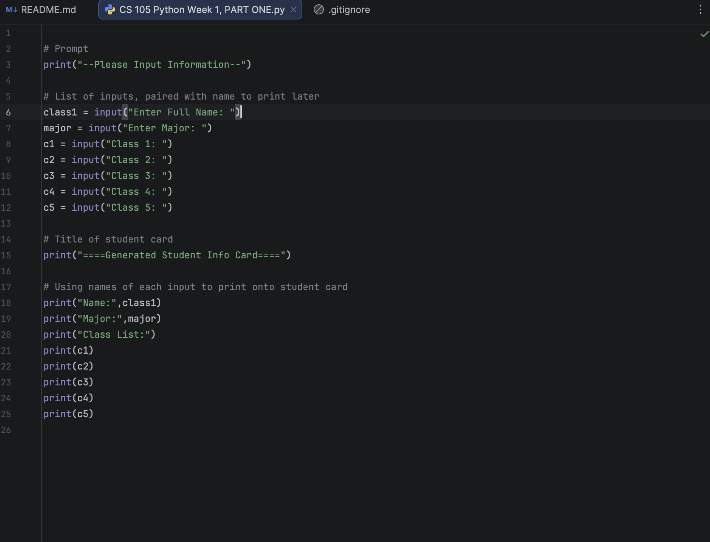

# Liam-Sandino

### About Me
Hello! I am an experienced Mail Clerk and organizational professional with over 5 years of proven expertise in customer service and organization. 
 	With skills in customer service, computer usage, teamwork, and organization, I am able to coordinate with colleagues to create an effective work environment. I am adept at using Microsoft Excel, Mac and Microsoft software, and Python apps. 
 	My versatile skill set, commitment to doing a good job, and passion for achieving perfection makes me a valuable asset.  In my spare time, I like to play basketball and draw. 
You can find me on LinkedIn, Instagram, or Handshake.

### Education
**BA in Psychology**  
Loyola University Maryland

### Projects

#### Project 1: Exponent Calculator
- )
- I created a simple calculator in Python to determine the use of exponents, using GitHub and PyCharm to navigate the project. Although the task was straightforward, it required problem-solving and learning basic concepts that were new to me. Through this experience, I gained familiarity with PyCharm, contributing to projects, and foundational Python skills that helped me later on.

***
#### Project 2 Title
- 
- Write-up here

***
#### Project 3 Title
- 
- Write-up here
